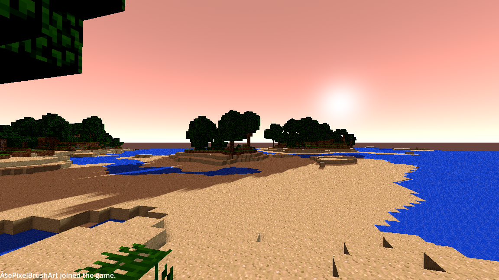

# BetaDot
A crude Beta 1.7.3-compatible client written in GDScript/Godot.

This is just a simple toy project that I wanted to make for the sake of it.
It implements enough of the Beta 1.7.3 spec to not immediately crash when joining a server.

## Features
- A main menu
- Connecting and Disconnecting
- Chunk meshing
- Textured blocks
- Moving
- Entities (somewhat)
- Real-time lighting
- Day-night cycle
- Chat coloration/formatting

## Not implemented
- Inventory management
- Proper entity rendering
- Items
- Swimming physics
- Gravity blocks
- Clouds
- Crafting
- Smelting
- Real-time block updates